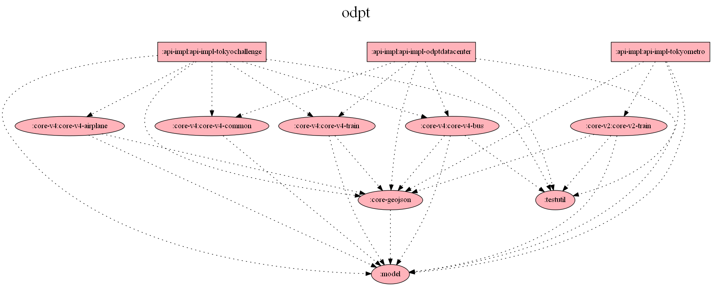

# このプロジェクトについて

[公共交通オープンデータ協議会](https://www.odpt.org/)（以下ODPTと呼ぶ）のAPIをKotlinで利用するためのクライアントであり、ODPTの規格に則った以下のAPIに対応している。

* v4
    + [東京公共交通オープンデータチャレンジ](https://tokyochallenge.odpt.org/)
    + [公共交通オープンデータセンター](https://www.odpt.org/)

なお、利用に際してはAPIアクセスのためのアクセストークンを得るために、上記サイトでの開発者登録が必須である。

# モジュール概要

* model :ODPT APIの各世代に共通のID項目等を定義
* testutil :テスト用のユーティリティ類
* core-geojson :GeoJSONをパースするためのライブラリ
* core-v4
    * core-v4-common :ODPT API v4の共通データAPIのデータをパースするためのライブラリ
    * core-v4-train :ODPT API v4の鉄道APIのデータをパースするためのライブラリ
    * core-v4-bus :ODPT API v4のバスAPIのデータをパースするためのライブラリ
    * core-v4-airplane :ODPT API v4の航空機APIのデータをパースするためのライブラリ（現在未実装）
* api-impl
    * api-impl-tokyochallenge :東京公共交通オープンデータチャレンジAPIにアクセスするためのライブラリ。第3回大会のリファレンスに準拠
    * api-impl-odptdatacenter :公共交通オープンデータセンターAPIにアクセスするためのライブラリ

なお、モジュール間の依存関係は以下のようになる。



## api-impl下のモジュールのテストについて

それぞれのAPIのアクセストークンを consumer_key.txt に記載して test/resources の下に納める必要がある。

# ライセンス

ODPTのAPIアクセスに関してはそれぞれのAPIの開発者サイトの規約に従うこと。

```
Copyright (C) 2019 teracy

Licensed under the Apache License, Version 2.0 (the "License");
you may not use this file except in compliance with the License.
You may obtain a copy of the License at

   http://www.apache.org/licenses/LICENSE-2.0

Unless required by applicable law or agreed to in writing, software
distributed under the License is distributed on an "AS IS" BASIS,
WITHOUT WARRANTIES OR CONDITIONS OF ANY KIND, either express or implied.
See the License for the specific language governing permissions and
limitations under the License.
```
